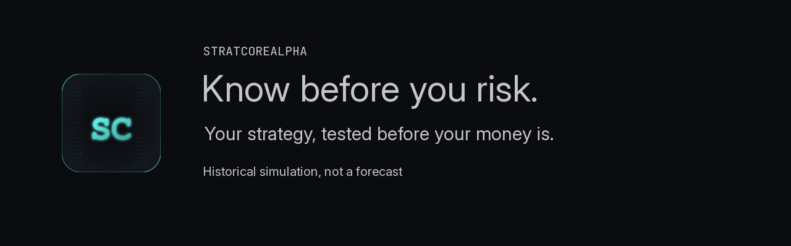

# Arnold Holm / StratCoreAlpha

## Know before you risk.

Test your trading strategy before you risk real money. I turn your rules into an MT5 bot and show you, on 12 months of real market data, exactly what it would have done, including whether it would have broken your prop firm's rules.

[Free Strategy Rule Check](https://stratcorealpha.com/rule-check?ref=github&intent=rule-check)

Still writing your rules? Start with the free Rule Check. Rules ready and you want evidence? Choose T99. You already need the deployment bot? E149 may fit without a detour. Want the test, bot and care together? CR499 is the complete path. Already have a bot with one reproducible defect? Use R49. No purchase is needed to download the rule sheet.

## Start with your rules

- **Free Strategy Rule Check (LM0):** I mark the missing decisions in one strategy. The editable rule sheet is free to download without an email address.
- **[Strategy Reality Check (T99)](https://stratcorealpha.com/reality-check?ref=github&intent=t99): 99 EUR/USD.** One strategy, one symbol and one timeframe. An MT5 test program, three rule checks, a 12-month historical simulation and a plain-language report with limits. Delivery: 72 hours after frozen rules and funding.
- **[Challenge-Ready Path (CR499)](https://stratcorealpha.com/challenge-ready?ref=github&intent=cr499): 499 EUR/USD.** T99, two named prop-firm overlays, the bot build, one rule-change retest and three months of Bot Care. Milestones: 149 / 200 / 150.
- **[First-Five pilot](https://stratcorealpha.com/pilot?ref=github&intent=pilot):** The first five delivered tests cost 0. The next five cost 49 EUR/USD. After that, the standard price is 99 EUR/USD. I ask for written feedback within seven days, not a positive review. Written rules, MT5 and a planned or active challenge are required. I review eligible requests in order of arrival, with one pilot per person. A form submission does not reserve a place. The free tier is direct; existing marketplace contacts stay on their marketplace. Publication of your case is a separate, voluntary choice.

The three written acceptance cases pass or delivery is not finished. I correct a mismatch reported within seven calendar days when you supply the original inputs and a reproducible result for the same agreed case. New rules, another broker or platform, or a different defect are new scope. This covers delivery, not trading results. No refund or challenge-pass promise is added.

This is a historical simulation under stated assumptions, not a forecast. Prices and execution can differ by feed and broker. A test cannot establish future fills, slippage or returns. Changing rules after seeing results can fit past noise. Missing intraday equity can leave a prop-rule check inconclusive. Passing the three rule cases shows that the code followed those cases; it does not mean that a challenge will pass.

## Existing bot owners

Already have a bot that misbehaves? I also fix one reproducible MT4/MT5 defect with three agreed tests. [R49: 49 USD / 48 hours after source review and funding](https://stratcorealpha.com/bot-fix?ref=github&intent=r49).

## Current proof

No complete strategy case has been published yet. Each case will include the frozen rules, source, full period, costs, curve and limitations.

- [Public engineering portfolio](https://github.com/arnjesix/stratcorealpha-mql5-portfolio)
- [Pine Script timing and alert tools](https://github.com/arnjesix/stratcorealpha-pine-portfolio)
- [Public MQL5 profile](https://www.mql5.com/en/users/stratcorealpha)
- [Contact](mailto:contact@stratcorealpha.com)

#TestedBeforeRisked

## Public implementation proof

- [PropGuard MT5 drawdown risk dashboard](https://www.mql5.com/en/code/68087)
- [Multi-symbol wick rejection scanner](https://www.mql5.com/en/code/68101)
- [Modern dark-mode one-click MT5 trade panel](https://www.mql5.com/en/code/68038)
- [cTrader boundary lab](https://github.com/arnjesix/stratcorealpha-ctrader-boundary-lab) : 15 deterministic tests for ownership, session, pending-expiry and restart-baseline policy.

These are public engineering examples, not trading-performance claims.

## Free diagnostic tools

- [MT5 Position and Order Ownership Audit](https://github.com/arnjesix/stratcorealpha-mql5-portfolio/releases/tag/v1.5.0) : classify open exposure against one expected EA magic number before a management or recovery repair.
- [MT5 Deal Evidence Toolkit](https://github.com/arnjesix/stratcorealpha-mql5-portfolio/releases/tag/v1.4.0) : export and compare stored tester-versus-deployment deal evidence under a fixed 19-field contract.
- [MT5 EA Acceptance Harness](https://github.com/arnjesix/stratcorealpha-mql5-portfolio/releases/tag/v1.3.0) : run eight synthetic timing, duplicate, cooldown and daily-lock fixtures without sending trades.
- [MT5 Cash Risk Probe](https://github.com/arnjesix/stratcorealpha-mql5-portfolio/releases/tag/v1.2.0) : inspect account-currency sizing and broker volume boundaries without placing an order.
- [MT5 Order Preflight](https://github.com/arnjesix/stratcorealpha-mql5-portfolio/releases/tag/v1.1.0) : check hypothetical order geometry against current symbol constraints.

All five utilities are read-only engineering evidence. They do not validate a
strategy or promise execution or performance results.

## How I work

1. Confirm entry, exit, risk, timing and edge-case rules.
2. Freeze a short specification and acceptance examples.
3. Implement and test against the approved behaviour.
4. Deliver editable source, compiled build, documented inputs and setup notes as
   agreed.

Trading results remain uncertain. I do not decompile protected EX4/EX5 files.
